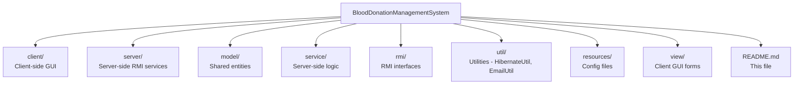

# Blood Donation Management System

Welcome to the **Blood Donation Management System!**  
This repository contains a **two-phase project** built in Java to manage donors, donations, and blood requests.

---

## About This Repository 

This project is developed academically and showcases a progressive development from **DAO/JDBC** to a **full RMI + Hibernate client-server system**.

### Branches Overview
  
| Branch | Description | 
|--------|-------------|
| `phase2-final` | **Phase 2 (Final)** — Hibernate ORM + RMI-based client-server version. Default branch. Exam-ready and production-like. |
| `phase-1` | **Phase 1 (Initial)** — DAO + JDBC + Swing GUI version. Used for learning and initial prototype. |

> If you are new to this project, start with the `phase-1` branch to explore the full functionality.   

---

## Phase 2 — Final Version (Default Branch) 

### Technologies Used

| Technology | Role |
|---|---|
| Java (Swing) | GUI framework |
| Hibernate ORM | Database persistence |
| Java RMI | Client-server communication |      
| JavaMail | OTP/email feature | 
| MySQL / MariaDB | Database |
| GitHub | Version control | 

### Key Features

- **User Authentication** — Login & Registration
- **Donor Management** — Add, edit, delete, and view donors  
- **Donation Recording** — Track blood donations with donor linkage  
- **Blood Request Management** — Hospitals/Patients request blood
- **Blood Inventory Tracking** — Automatically updates stock based on donations and requests 
- **PDF Export** — Generate reports for records
- **RMI Integration** — Distributed system with server-client architecture
- **Hibernate ORM** — Database persistence with annotations and entity relationships  
  
---

## Screenshots

   

### Authentication    

| Login | Register |
|-------|----------|
|  |  |

### Donor Management

### Donation Recording

### Blood Request
 

---

## Project Structure

---

## How to Run

**1. Server**

- Open the `server` folder in NetBeans
- Ensure the database is running and `hibernate.cfg.xml` has correct credentials
- Run `ServerMain.java` to start the RMI server

**2. Client**

- Open the `client` folder in NetBeans
- Ensure the server is running
- Run `ClientMain.java` to launch the GUI

---

## Phase 1 — Initial Version (`phase-1` branch)

- DAO + JDBC version
- Swing GUI for donor, donation, and blood request management
- Useful for learning and understanding the system's evolution

> To explore Phase 1, switch to the `phase-1` branch in GitHub.

---

## Database Schema

### Donors

| Column | Type |
|---|---|
| `donor_id` | INT (PK) |
| `name` | VARCHAR(100) |
| `blood_type` | VARCHAR(10) |
| `email` | VARCHAR(100) |
| `phone` | VARCHAR(20) |

### Donations

| Column | Type |
|---|---|
| `donation_id` | INT (PK) |
| `donor_id` | INT (FK) |
| `donation_date` | DATETIME |
| `volume_ml` | INT |
| `remarks` | VARCHAR(255) |

### Blood Requests

| Column | Type |
|---|---|
| `request_id` | INT (PK) |
| `patient_name` | VARCHAR(100) |
| `blood_type_needed` | VARCHAR(10) |
| `quantity_needed` | INT |
| `request_date` | DATETIME |
| `status` | VARCHAR(50) |

> Hibernate automatically manages schema mapping in Phase 2.

---

## Purpose

- Demonstrates a **full client-server system** with RMI and Hibernate
- Shows evolution from DAO/JDBC to modern architecture
- Academic demonstration and **portfolio-ready project**
